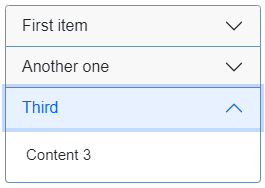
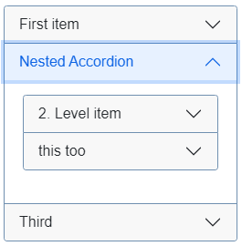

# jbsAccordion
Collapsible items and accordions (also nested) for Joomla 4 (Bootstrap 5)

Doesn't come with a big framework or a lot of gimmicks. It's only one single php-script with less than 200 codelines.
But it (hopefully) does it's job:

### Single Collapsibles:
```
{jbscard Single Collapse}
   <h4><span style="color: #800080;"><em>Content</em></span></h4>
{/jbscard}
```


### Accordions:
```
{jbsgroup}
   {jbscard First item}Content 1{/jbscard} 
   {jbscard Another one}Content 2{/jbscard}
   {jbscard Third}Content 3{/jbscard}
{/jbsgroup}
```


### Nested Accordions
```
{jbsgroup}
   {jbscard First item}Content 1{/jbscard}
   {jbssubgroup Nested Accordion}
      {jbscard 2. Level item}Content 2.1{/jbscard}
      {jbscard this too}Content 2.2{/jbscard}
   {/jbssubgroup}
   {jbscard Third}Content 3{/jbscard}
{/jbsgroup}
```


---

You can format the header too:


Format the header text only (not the whole tag) and use span instead of h1,h2.. Don't use block-tags either.

`{jbscard <strong><em><span style="color: #3366ff; font-size: 150%;">Formatted</span></em></strong>}`

---

The Plugin can translate the tags from Reguar Labs Sliders (which a the moment doesn't support joomla 5) in a limited way. (No parameters in Headertag, No nested accordion).<br/>
You can activate this by enabling `convertRLsliders` in jbsaccordion.php:
```
protected $convertRLsliders = 1;
```
---
You can style the accordions in your custom.css by overwriting the bootstrap-styles.
In the above pictures I used:
```
div.accordion-item { margin:5px; }
button.accordion-button { background-color:#F8F8F8; padding: 8px 16px; }
```
